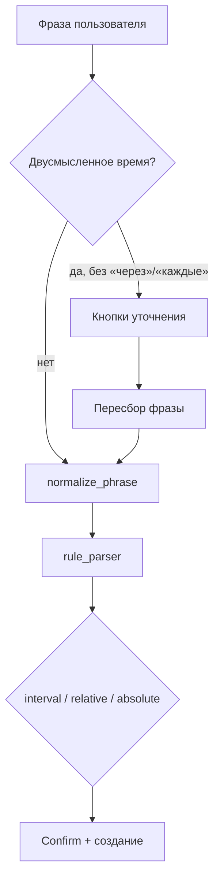

# NLP: приоритеты времени в фразе

Как бот разбирает комбинации «сегодня / завтра» + время + задача.

## Три типа «времени»

| Тип | Примеры | Смысл |
|-----|---------|--------|
| **Относительное** | через 1 минуту, через 2 дня, через час | `now + offset` |
| **Абсолютное** | завтра в 14:00, сегодня утром | конкретная дата/час |
| **Якорь дня без часа** | завтра созвон | нужен час → уточнение или 9:00 |

## Правило приоритета

```
1. Расписание (каждые N, ежедневно, по будням)  → interval/daily/weekly
2. Относительное «через …»                       → now + delay  ★ побеждает якорь дня
3. Явное время (14:00, утром, в 2 дня)           → absolute datetime
4. Двусмысленный час (завтра в 2)                → кнопки день/ночь
5. Только день (завтра созвон)                     → кнопки 9/14/18
6. LLM / dateparser                                → fallback
```

**Ключевое:** слова «сегодня» / «завтра» в одной фразе с «через N …» — **не дата**, а разговорная emphasis.  
`сегодня через 1 минуту тест` = `через 1 минуту тест` → через 60 сек, задача «тест».

## Таблица примеров

| Фраза | Поведение | Задача |
|-------|-----------|--------|
| сегодня через 1 минуту тест | once, +1 мин | тест |
| завтра через 2 дня оплатить | once, +2 дня | оплатить |
| завтра через час созвон | once, +1 ч | созвон |
| сегодня в 14:00 тест | once, сегодня 14:00 | тест |
| завтра утром зарядка | once, завтра ~09:00 | зарядка |
| завтра в 2 созвон | уточнение день/ночь | созвон |
| завтра созвон | уточнение 9/14/18 | созвон |
| завтра каждые 2 часа встать | interval 2 ч | встать |
| через 1 минуту тест | once, +1 мин | тест |

## Пайплайн обработки



## normalize_phrase — осторожно

`normalize_part_of_day` не должен трогать **длительность** «через N дня/дней»  
(раньше «2 дня» превращалось в «в 14:00»).

Защита: если перед «N дня» стоит «через » — не нормализовать как «часть дня».

## Код

| Модуль | Роль |
|--------|------|
| `absolute_time_parse.py` | `RELATIVE_OFFSET`, `has_relative_offset`, `strip_day_words`, absolute parse |
| `ambiguous_time.py` | уточнение только если **нет** relative/schedule |
| `rule_parser.py` | relative раньше absolute; задача без якоря дня |
| `ambiguous_prompt.py` | UI уточнения до парсинга |
