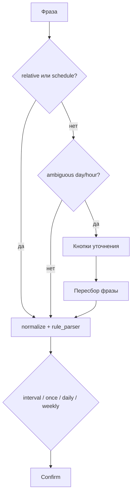

# NLP: приоритеты времени в фразе

Как бот разбирает комбинации «сегодня / завтра» + время + задача.

См. также: [quality-metrics.md](quality-metrics.md) · тесты `test_nlp_time_priority.py`, `test_rule_parser.py`, `test_ambiguous_time.py`.

---

## Три типа «времени»

| Тип | Примеры | Смысл |
|-----|---------|--------|
| **Относительное** | через 1 минуту, через 2 дня, через час | `now + offset` |
| **Абсолютное** | завтра в 14:00, сегодня утром | конкретная дата/час |
| **Якорь дня без часа** | завтра созвон | нужен час → уточнение или дефолт |
| **Расписание** | каждые 2 часа, по будням в 9:00 | interval / daily / weekly |

---

## Правило приоритета

```
1. Расписание (каждые N, ежедневно, по будням)  → interval / daily / weekly
2. Относительное «через …»                       → now + delay  ★ побеждает якорь дня
3. Явное время (14:00, утром, в 2 часа дня)      → absolute datetime
4. Двусмысленный час (завтра в 2)                → кнопки ☀️ день / 🌙 ночь
5. Только день (завтра созвон)                     → кнопки 🌅9 / ☀️14 / 🌇18
6. LLM / dateparser                                → fallback
```

**Ключевое:** «сегодня» / «завтра» **+ «через N …»** — якорь дня **игнорируется** для расчёта времени (разговорное усиление).  
Задача очищается от лишнего «сегодня/завтра» в тексте.

---

## 1. Относительное «через …» (once)

| Фраза | Когда | Задача |
|-------|-------|--------|
| через 1 минуту тест | +1 мин | тест |
| через 30 минут выпить таблетки | +30 мин | выпить таблетки |
| через полчаса таблетки | +30 мин | таблетки |
| через пару минут звонок | +2 мин | звонок |
| через час созвон | +1 ч | созвон |
| через 3 часа отчёт | +3 ч | отчёт |
| через полтора часа обед | +90 мин | обед |
| через несколько часов созвон | +3 ч (дефолт) | созвон |
| через 2 дня оплатить | +2 дня | оплатить |
| через неделю отчёт | +7 дней | отчёт |
| через 2 недели созвон | +14 дней | созвон |
| через месяц оплатить | +30 дней | оплатить |
| через 2 месяца отчёт | +60 дней | отчёт |
| через 5-10 минут (диапазон) | max диапазона | … |
| напомни через 15 минут позвонить | +15 мин | позвонить |

### Якорь дня + «через …» (якорь не влияет на время)

| Фраза | Когда | Задача |
|-------|-------|--------|
| **сегодня через 1 минуту тест** | +1 мин | тест |
| сегодня через 5 минут позвонить | +5 мин | позвонить |
| сегодня через полчаса таблетки | +30 мин | таблетки |
| завтра через час созвон | +1 ч | созвон |
| **завтра через 2 дня оплатить** | +2 дня | оплатить |
| послезавтра через 3 часа встреча | +3 ч | встреча |
| созвон сегодня через 10 минут | +10 мин | созвон |

**Не** показывать «Уточни время» для этих фраз.

---

## 2. Абсолютное время (once)

| Фраза | Когда | Задача |
|-------|-------|--------|
| сегодня в 14:00 тест | сегодня 14:00 | тест |
| завтра в 14.00 создать бота | завтра 14:00 | создать бота |
| послезавтра в 9:00 звонок | послезавтра 09:00 | звонок |
| в 18:00 завтра ужин | завтра 18:00 | ужин |
| завтра утром зарядка | завтра ~09:00 | зарядка |
| сегодня вечером созвон | сегодня ~18:00 | созвон |
| завтра в 2 часа дня созвон | завтра 14:00 | созвон |
| 15 марта в 10:00 отчёт | дата + 10:00 | отчёт |
| 15 марта отчёт | дата 09:00 (дефолт) | отчёт |

---

## 3. Двусмысленное время → кнопки

### «Завтра в 2» (час 1–11 без минут)

| Фраза | UI | После выбора |
|-------|-----|--------------|
| завтра в 2 созвон | ☀️ день / 🌙 ночь | 14:00 или 02:00 |
| завтра в два созвон | то же | |
| созвон завтра в 2 | то же (суффикс) | |
| напомни завтра в 2 созвон | то же | |

**Не** двусмысленно, если есть уточнение:

| Фраза | Почему |
|-------|--------|
| завтра в 2:00 созвон | явные минуты |
| завтра в 2 дня созвон | «2 часа дня» = 14:00 |
| завтра в 14:00 созвон | явное время |

### «Завтра …» без времени

| Фраза | UI | После выбора |
|-------|-----|--------------|
| завтра созвон | 🌅 9 / ☀️ 14 / 🌇 18 | 9:00 / 14:00 / 18:00 |
| послезавтра отчёт | то же | |
| созвон завтра | то же (суффикс) | |

**Не** показывать UI, если есть «через …», «каждые …», «14:00», «утром» и т.д.

---

## 4. Расписание (interval / daily / weekly)

| Фраза | Тип | Период |
|-------|-----|--------|
| каждые 2 часа встать | interval | 2 ч |
| каждые 30 минут проверить | interval | 30 мин |
| каждые полчаса встать | interval | 30 мин |
| каждый час перерыв | interval | 1 ч |
| каждый день в 9:00 зарядка | daily | 09:00 |
| ежедневно в 9:00 зарядка | daily | 09:00 |
| по будням в 09:00 зарядка | weekly | пн–пт 09:00 |
| по выходным в 11:00 уборка | weekly | сб–вс 11:00 |

### Якорь дня + расписание

| Фраза | Тип | Задача |
|-------|-----|--------|
| завтра каждые 2 часа встать | interval | встать (без «завтра» в задаче) |
| сегодня каждый день в 8:00 … | daily | … |

---

## 5. Префиксы и порядок слов

| Вариант | Пример |
|---------|--------|
| Команда | `/remind через 5 минут тест` |
| Напомни | `напомни завтра в 2 созвон` |
| Задача впереди | `созвон завтра в 2` |
| @mention в группе | `@бот @user сегодня через 1 минуту тест` |
| Reply + remind | `@бот через 10 минут тест2` (кому — из reply) |

---

## 6. Анти-пatterns (частые ошибки парсера)

| Было (баг) | Стало |
|------------|-------|
| «сегодня через 1 мин» → «Уточни время» 9/14/18 | сразу confirm +1 мин |
| «через 2 дня» → normalize в «в 14:00» | offset +2 дня |
| «завтра в 2 дня» → task «дня созвон», 02:00 | task «созвон», 14:00 |
| «завтра каждые 2 часа» → task «завтра встать» | task «встать» |
| задача «сегодня тест» после «через 1 мин» | задача «тест» |

---

## Пайплайн



---

## normalize_phrase

Перед rule_parser фраза нормализуется:

| Вход | Выход |
|------|-------|
| 14.00 | 14:00 |
| в 1430 | в 14:30 |
| в 2 часа дня | в 14:00 |
| **через 2 дня** | **не трогать** (не «в 14:00») |

Защита: «N дня/дней» после «через » — **длительность**, не «часть дня».

---

## Код

| Модуль | Роль |
|--------|------|
| `absolute_time_parse.py` | `RELATIVE_OFFSET`, `has_relative_offset`, `has_schedule_mark`, `strip_day_words`, absolute |
| `ambiguous_time.py` | `detect_ambiguous_day_hour`, `detect_ambiguous_day_only` |
| `ambiguous_prompt.py` | UI до парсинга |
| `rule_parser.py` | relative → absolute → dateparser |
| `llm_parser.py` | fallback Groq/Gemini/OpenAI |

---

## Чеклист для новых фраз

При добавлении паттерна проверить:

1. Не ломает ли `normalize_part_of_day` duration («через N дня»)?
2. Не попадает ли в `detect_ambiguous_day_only` ошибочно?
3. Якорь дня убирается из текста задачи?
4. Есть тест в `test_nlp_time_priority.py`, `test_rule_parser.py` или `test_ambiguous_time.py`?
