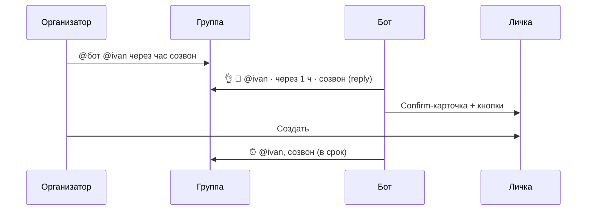
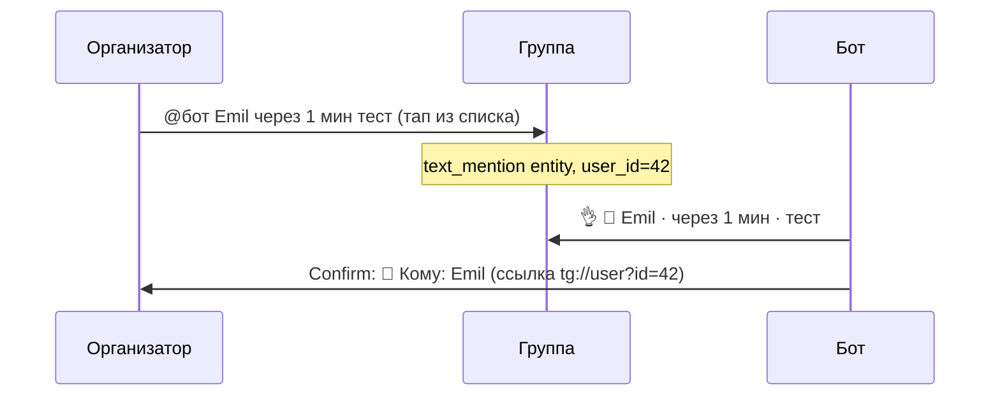
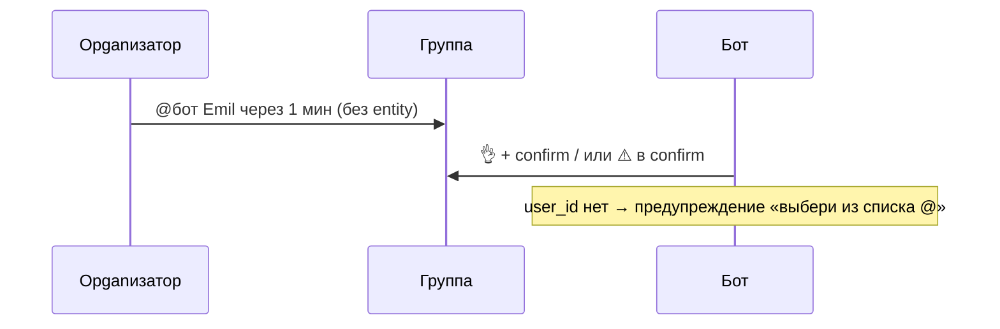

# План v2: `@бот` + участник в группах

**Статус:** ✅ v3.46.0 · **релиз готов к деплою**  
**Контекст:** жалоба «формат `@бот @пользователь` не работает» (скрин: `@break_remind_bot Emil Через 1 минуту тест`, ответа в группе нет)  
**Связано:** [group-assignee.md](../guides/group-assignee.md) · [groups-and-channels.md](../guides/groups-and-channels.md) · v3.44.8–v3.45.8

---

## 1. Контекст и цели

### 1.1 Продуктовая цель

Пользователь в группе должен **одной фразой** назначить напоминание **конкретному участнику** и получить **явную обратную связь** в том же чате — без догадок «бот сломался / ушёл в личку / не понял имя».

### 1.2 Техническая цель

Единый пайплайн assignee для всех способов ввода, которые Telegram **реально** отдаёт боту:

| Способ | Entity в API | Пример в UI |
|--------|--------------|-------------|
| `@username` | `mention` | `@ivan` |
| Имя из списка | `text_mention` | `Emil` (без `@`) |
| Reply на сообщение | `reply_to_message` | без `@` в тексте |
| Голос + caption | `caption` + `caption_entities` | подпись `@бот @ivan` |

### 1.3 Не-цели (out of scope)

- Несколько assignee на одно напоминание
- Resolve участника **только по набранному имени** без entity (Bot API не даёт search by name)
- Inline-меню создания в группе (by design — команды + @)
- Каналы: assignee не используется

### 1.4 KPI успеха (после деплоя)

| Метрика | Как измерить | Цель |
|---------|--------------|------|
| Reply в группе | Smoke в «Болталке» | 100% сценариев с `@бот` |
| Assignee из списка | `@бот` + тап по имени | `user_id` в draft |
| Ложные «молчания» | Жалобы / support | 0 на 7 дней |
| Parse fail с подсказкой | `@бот Emil` руками | Текст «выбери из списка @» |

---

## 2. Персоны и user journeys

### 2.1 Организатор (создатель)

> «Хочу напомнить коллеге через час прямо в группе проекта»



### 2.2 Участник без username

> «У меня нет @username, но меня выбрали из списка как Emil»



### 2.3 Новичок (ошибка ввода)

> «Написал `@бот Emil` руками, думал что так же как в WhatsApp»



### 2.4 Админ с Group Privacy

> «Бот молчит на `@бот`, но `/remind@бот` работает»

→ Ops-сценарий, не баг парсера. Welcome + `/sysinfo` + BotFather.

---

## 3. Архитектура пайплайна

### 3.1 Точки входа

| Handler | Файл | Триггер |
|---------|------|---------|
| `handle_text` | `bot/handlers/create.py` | текст без `/` |
| `handle_edited_text` | `bot/handlers/create.py` | правка сообщения |
| `cmd_remind` | `bot/handlers/create.py` | `/remind@бот …` |
| `handle_voice` / `handle_video_note` | `bot/handlers/create.py` | голос + reply/caption |
| `cmd_edit` | `bot/handlers/edit.py` | `/edit N @user …` |

### 3.2 Фильтр «обрабатывать ли сообщение»

```
should_handle_collective_message (bot_mention.py)
├── личка → всегда True
├── канал → только команды
└── группа → is_bot_mentioned
    ├── entity mention/text_mention бота
    ├── @username в тексте (regex, без ложных @mybot123)
    └── reply на сообщение бота
```

### 3.3 Извлечение assignee (приоритет)

```
extract_create_mention (mention_create.py)
│
├── from_transcription (голос) → regex на фразе STT
│
└── иначе → extract_mention_from_message (mention_parse.py)
    ├── entities / caption_entities (text_mention, mention)
    ├── regex @user (USERNAME_ANYWHERE, префиксы для/кому/напомни)
    ├── plain name fallback (_extract_leading_plain_name)
    └── reply_to_message (если @ не найден)
```

### 3.4 Confirm и обратная связь

```
_process_text_and_reply (create.py)
├── parse_all_reminders
├── offer_assignee_choice (несколько @ без времени)
└── deliver_create_confirm (create_confirm.py)
    ├── личка → answer в чат
    └── группа → send_collective_confirm (collective_confirm.py)
        ├── DM: полная карточка + кнопки
        └── группа: reply 👌 preview (reply_to_message_id)
            └── fallback: answer в чат если DM заблокирован
```

### 3.5 Карта модулей

| Модуль | Ответственность |
|--------|-----------------|
| `mention_parse.py` | Разбор текста, entities, plain name, auto-pick |
| `mention_create.py` | CreateMention, приоритет @ vs reply, pick_note |
| `mention_resolve.py` | user_id → проверка «в чате» |
| `bot_mention.py` | Детект @бот, Group Privacy не здесь |
| `assignee_prompt.py` | Кнопки при нескольких @ без времени |
| `create_confirm.py` | Confirm-карточка, draft |
| `collective_confirm.py` | DM + hint в группе |
| `collective_preview.py` | `👤 @user · через 5 мин · задача` |
| `messages.py` | Тексты «Кому», parse fail, display name |

---

## 4. Каталог форматов ввода

### 4.1 Поддерживаемые (must work)

| ID | Формат | Пример | Assignee source |
|----|--------|--------|-----------------|
| F1 | `/remind@бот @user …` | `/remind@bot @ivan через час` | entity / regex |
| F2 | `@бот @user …` | `@bot @ivan через час` | entity / regex |
| F3 | `@бот + @user …` | разделители `+`, `—`, `,` | regex |
| F4 | `@бот@user …` | компакт | regex |
| F5 | `@бот Имя …` | `@bot Emil через 1 мин` | **text_mention** |
| F6 | `для/кому/напомни @user …` | `напомни @ivan …` | regex |
| F7 | reply + `/remind@бот …` | без @ в тексте | reply |
| F8 | reply на бота + фраза | «через час тест» | implicit bot mention |
| F9 | голос + reply на бота | STT фраза | transcription path |
| F10 | голос + caption `@бот @user` | caption_entities | caption path |
| F11 | текст до `@бот` | `ребят @bot @ivan через час` | strip before bot |
| F12 | несколько @user + время | `@bot @a @b через час` | auto nearest_time |
| F13 | несколько @user без времени | `@bot @a @b созвон` | кнопки «Кому?» |
| F14 | правка сообщения | edited_message | тот же пайплайн |

### 4.2 Частично поддерживаемые (degraded UX)

| ID | Формат | Поведение |
|----|--------|-----------|
| P1 | `@бот Emil …` **руками** | Имя в assignee, **нет user_id** → ⚠️ в confirm |
| P2 | `@user` набран с клавиатуры | Telegram может не передать entity → как P1 |
| P3 | Group Privacy **вкл** + ручной `@бот` | Бот **не получает** update → тишина (ops) |

### 4.3 Не поддерживаемые

| ID | Формат | Почему |
|----|--------|--------|
| N1 | «Emil через час» без @бот | Privacy / фильтр collective |
| N2 | `@бот напомни Emil и Petr` | один assignee |
| N3 | Assignee в канале | by design |

---

## 5. Диагностическая матрица (troubleshooting)

| # | Симптом | Вероятная причина | Где смотреть | Действие |
|---|---------|-------------------|--------------|----------|
| T1 | Полная тишина | Group Privacy, бот не получил update | `/sysinfo`, BotFather | Privacy off или `/remind@бот` |
| T2 | Тишина в группе, confirm в личке | DM ok, group hint не отправился / не заметили | `collective_confirm.py` logs | reply_to_message (✅ v2) |
| T3 | Assignee = создатель, не Emil | Нет entity, plain name не сработал | `extract_mention_from_message` | plain name fallback (✅) |
| T4 | Задача «Emil тест» вместо «тест» | Имя не вырезано из фразы | `mention_parse.py` | entity / plain name strip |
| T5 | «не в этом чате» | user_id не member | `mention_resolve.py` | ожидаемо |
| T6 | Parse fail | Нет времени в фразе | NLP | `format_parse_fail` + hint |
| T7 | Кнопки «Кому?» не те | несколько @ без времени | `assignee_prompt.py` | by design |
| T8 | После Edit не реагирует | edited_message handler | `create.py` | v3.44.8+ |
| T9 | Голос без assignee | caption_entities | `mention_parse.py` | caption path (✅ v2) |

---

## 6. Roadmap по фазам

### Фаза 0 — Baseline (до v3.45.8) ✅

- [x] auto-pick nearest_time (v3.44.8)
- [x] кнопки «Кому?» (v3.45.0)
- [x] edited_message (v3.44.8)
- [x] smoke_group_mentions + 21+ тестов assignee

### Фаза 1 — Парсинг display name ✅ (локально)

| ID | Задача | Файлы | Effort | Статус |
|----|--------|-------|--------|--------|
| 1.1 | `_message_text_and_entities()` — text vs caption | `mention_parse.py` | S | ✅ |
| 1.2 | `text_mention` без username → visible name + user_id | `mention_parse.py` | S | ✅ |
| 1.3 | `_extract_leading_plain_name()` — имя перед «через/завтра/в …» | `mention_parse.py` | M | ✅ |
| 1.4 | `_assignee_display_name()` — Emil vs @ivan в UI | `messages.py` | S | ✅ |
| 1.5 | parse fail hint: «имя из списка @» | `messages.py` | S | ✅ |
| 1.6 | Тесты: entity + plain name | `test_mention_parse.py`, `test_mention_from_message.py` | S | ✅ |
| 1.7 | smoke_group_mentions: display name case | `smoke_group_mentions.py` | S | ✅ |

### Фаза 2 — Видимость в группе ✅ (локально)

| ID | Задача | Файлы | Effort | Статус |
|----|--------|-------|--------|--------|
| 2.1 | `reply_to_message_id` в group hint | `collective_confirm.py`, `create_confirm.py`, `edit.py` | S | ✅ |
| 2.2 | Тест: send_collective_confirm передаёт reply | `test_collective_confirm.py` | S | ✅ |
| 2.3 | Handler test: `@bot Emil через 1 мин` → collective_mock | `test_006_collective_handlers.py` | S | ✅ |

### Фаза 3 — Надёжность 🔶 backlog

| ID | Задача | Файлы | Effort | P | Описание |
|----|--------|-------|--------|---|----------|
| 3.1 | UTF-16 safe entity slicing | `mention_parse.py` | M | P1 | ✅ |
| 3.2 | Retry group hint при ошибке send | `collective_confirm.py` | S | P1 | ✅ |
| 3.3 | Structured log: assignee source | `create.py` | S | P2 | ✅ |
| 3.4 | Метрика «DM ok / group hint fail» | `collective_confirm.py` | S | P2 | ✅ |
| 3.5 | Ack при total fail (DM + group) | `create_confirm.py` | S | P1 | ✅ |
| 3.6 | Unit: caption-only voice path | `test_mention_parse.py` | S | P2 | ✅ |

### Фаза 4 — UX polish 🔶 backlog

| ID | Задача | Effort | P | Описание |
|----|--------|--------|---|----------|
| 4.1 | Inline «Выберите участника» при P1 | M | P3 | Кнопки из recent @ в фразе |
| 4.2 | Welcome в группе: пример `@бот` + **тап по имени** | S | P2 | ✅ |
| 4.3 | `/remind` help: строка про display name | S | P2 | ✅ |
| 4.4 | format_collective_check_dm: имя без @ | S | P2 | уже частично в preview |
| 4.5 | Не создавать draft при unresolved plain name? | M | P3 | product decision |

### Фаза 5 — Документация и ops ⬜

| ID | Задача | Файл | Статус |
|----|--------|------|--------|
| 5.1 | Обновить group-assignee.md (F5, reply, caption) | `docs/guides/group-assignee.md` | ✅ |
| 5.2 | Обновить groups-and-channels troubleshooting | `docs/guides/groups-and-channels.md` | ✅ |
| 5.3 | Release note v3.46.0 | `docs/releases/v3.46.0.md` | ✅ |
| 5.4 | CHANGELOG секция | `CHANGELOG.md` | ✅ |
| 5.5 | Чеклист ops после деплоя | `docs/guides/ops-checklist.md` | ✅ |

### Фаза 6 — Релиз ⬜

| ID | Действие |
|----|----------|
| 6.1 | Bump `bot/version.py` + `pyproject.toml` → v3.46.0 | ✅ |
| 6.2 | `ruff check bot tests scripts` | ✅ |
| 6.3 | `python scripts/verify_ops.py` | ✅ |
| 6.4 | pytest assignee + collective suite | ✅ |
| 6.5 | Deploy Wispbyte | 📋 ручной (ops-checklist) |
| 6.6 | Telegram smoke (раздел 8) | 📋 ручной |
| 6.7 | GitHub Release + tag | ⬜ push v3.46.0 |

---

## 7. Edge cases (энциклопедия)

### 7.1 Entities

| Case | Вход | Ожидание |
|------|------|----------|
| E1 | Bot `mention` + user `text_mention` | user_id из text_mention |
| E2 | text_mention без username | visible «Emil» + user_id |
| E3 | Два text_mention user | auto nearest_time |
| E4 | Bot text_mention (display name бота) | is_bot_mention → skip |
| E5 | Entity offset после `/remind@bot ` | prefix_len учтён |
| E6 | Emoji в имени «👋 Emil» | ⚠️ риск UTF-16 (фаза 3.1) |

### 7.2 Текст без entities

| Case | Вход | Ожидание |
|------|------|----------|
| E7 | `@bot Emil через 1 мин` | plain name → ⚠️ unresolved |
| E8 | `@bot @alice через час` | regex → alice |
| E9 | `@bot через час @alice` | trailing @ → alice |
| E10 | `@bot@alice,задача` | comma separator |
| E11 | `@bot @alice @bob созвон` | кнопки выбора |
| E12 | `@bot @alice @bob через час` | bob (nearest time) |

### 7.3 Collective / permissions

| Case | Условие | Ожидание |
|------|---------|----------|
| E13 | User не в группе | resolve → None, warning |
| E14 | Bot can't post | hint в confirm |
| E15 | DM blocked | fallback answer в группу |
| E16 | Discussion group → channel | delivery_chat_id = channel |

### 7.4 Голос

| Case | Вход | Ожидание |
|------|------|----------|
| E17 | reply на бота, STT «@ivan через час» | from_transcription |
| E18 | caption `@bot @ivan`, voice | caption_entities |
| E19 | STT «через час @ivan» | trailing mention |

---

## 8. Матрица ответов UX

| Ситуация | Ответ в группе | Confirm в личке |
|----------|----------------|-----------------|
| Успех, assignee resolved | `👌 👤 @ivan · …` (reply) | `👤 Кому: @ivan` + кнопки |
| Успех, display name | `👌 👤 Emil · …` | ссылка tg://user?id= |
| Unresolved plain name | reply + ⚠️ в confirm | «выбери из списка @» |
| Несколько @, нет времени | «Кому напомнить?» + кнопки | — |
| Parse fail | parse fail + 💡 форматы | — |
| DM fail | полный confirm в группе | — |
| Privacy: бот не видит | — (нет update) | — |

---

## 9. Тестовая стратегия

### 9.1 Пирамида

```
                    ┌─────────────────┐
                    │ Telegram manual │  8 сценариев (§8 чеклист)
                    └────────┬────────┘
               ┌─────────────┴─────────────┐
               │ test_006_collective_handlers │  integration handlers
               └─────────────┬─────────────┘
     ┌────────────────────────┼────────────────────────┐
     │ test_mention_*  test_assignee_*  test_collective_* │  unit/service
     └────────────────────────┬────────────────────────┘
                    ┌─────────┴─────────┐
                    │ smoke_group_mentions │  offline CI
                    └───────────────────┘
```

### 9.2 Обязательные файлы (CI)

```bash
pytest tests/test_mention_parse.py \
       tests/test_mention_from_message.py \
       tests/test_mention_create.py \
       tests/test_mention_assignee_text.py \
       tests/test_mention_resolve.py \
       tests/test_assignee_pick_note.py \
       tests/test_assignee_prompt.py \
       tests/test_assignee_callbacks.py \
       tests/test_006_collective_handlers.py \
       tests/test_collective_confirm.py \
       tests/test_bot_mention.py \
       -q

python scripts/smoke_group_mentions.py
python scripts/verify_ops.py
```

### 9.3 Новые тесты (фаза 2–3)

| Тест | Файл | Покрывает |
|------|------|-----------|
| `test_send_collective_confirm_with_reply` | `test_collective_confirm.py` | 2.2 |
| `test_handle_text_bot_display_name_entity` | `test_006_collective_handlers.py` | F5 end-to-end |
| `test_extract_mention_caption_entities` | `test_mention_parse.py` | F10 |
| `test_plain_name_unresolved_confirm_line` | `test_mention_assignee_text.py` | P1 UX |
| `test_utf16_emoji_display_name` | `test_mention_parse.py` | 3.1 |

### 9.4 Ручной smoke (Telegram)

| # | Действие | Pass criteria |
|---|----------|---------------|
| S1 | `@бот @user через 1 мин тест` | reply в группе ≤3 сек |
| S2 | `@бот` + **тап Emil из списка** + `через 1 мин` | preview с **Emil**, не @ |
| S3 | S2 → confirm → создать → срабатывание | тег Emil в группе |
| S4 | `@бот Emil` **руками** | ⚠️ в confirm |
| S5 | `@бот @a @b созвон` | кнопки |
| S6 | `/remind@бот @user …` | как S1 |
| S7 | reply на участника + `/remind@бот …` | ↩️ Кому |
| S8 | Group Privacy вкл → `/remind@бот` | работает; ручной @ — нет |

---

## 10. Observability

### 10.1 Логи (целевые, фаза 3.3)

```
INFO Group text chat=-100… user=… raw=@break_remind_bot Emil Через…
INFO assignee source=text_mention user_id=42 username=emildg8 phrase=Через 1 минуту тест
WARNING Cannot send collective check-dm hint to -100…: …
```

### 10.2 Admin-сигналы

| Событие | Куда | Условие |
|---------|------|---------|
| Group hint fail | `bot.log` | всегда |
| DM fail rate | health_monitor? | фаза 3.4, optional |
| Privacy on at startup | admin DM | уже есть |

### 10.3 Debug-команды

| Команда | Информация |
|---------|------------|
| `/sysinfo` | Group Privacy status |
| `/ping` | версия бота |
| `/status` | личка, timezone |

---

## 11. Rollout

### 11.1 Pre-deploy

- [ ] Все тесты §9.2 green локально
- [ ] diff review: `mention_parse.py`, `collective_confirm.py`, `messages.py`
- [ ] CHANGELOG + release note готовы

### 11.2 Deploy

- [ ] Push → CI green
- [ ] Wispbyte restart / auto-update
- [ ] `/ping` → v3.46.0

### 11.3 Post-deploy (15 мин)

- [ ] S1, S2, S6 в боевой группе
- [ ] Проверить `data/logs/bot.log` на assignee lines
- [ ] `/sysinfo` в группе (если admin)

### 11.4 Rollback

| Условие | Действие |
|---------|----------|
| Регресс assignee | revert tag, redeploy v3.45.8 |
| Crash loop | rollback + hotfix branch |
| Только UI текст | forward fix, не rollback |

---

## 12. Риски

| Риск | Вероятность | Impact | Mitigation |
|------|-------------|--------|------------|
| UTF-16 emoji в именах | Средняя | Неверный assignee / parse | Фаза 3.1, тест E6 |
| Plain name = слово задачи («Через») | Низкая | Ложный assignee | `_PLAIN_NAME` + anchor |
| Пользователи не видят DM | Высокая | «Бот молчит» | reply в группе (фаза 2) |
| Group Privacy | Высокая | Тишина | docs + welcome |
| Resolve @username вне чата | Средняя | warning | mention_resolve |
| Кэш members by name | — | GDPR / ошибки | **не делать** |

---

## 13. Open questions

| # | Вопрос | Варианты | Рекомендация |
|---|--------|----------|--------------|
| Q1 | Создавать draft при unresolved plain name? | A) да + warning / B) block | **A** — не блокировать создателя |
| Q2 | v3.45.9 patch vs v3.46.0 minor? | patch / minor | **minor** — новый UX display name |
| Q3 | Inline-кнопки при P1? | да / нет | отложить (4.1) |
| Q4 | Логировать raw message в prod? | да / truncate | truncate 120 chars (уже есть) |

---

## 14. Definition of Done (релиз v3.46.0)

### Код

- [x] Фаза 1 — парсинг display name
- [x] Фаза 2.1 — reply в группе
- [ ] Фаза 2.2–2.3 — недостающие тесты handlers
- [ ] Фаза 3.1 или documented known issue UTF-16

### Качество

- [ ] pytest §9.2 green
- [ ] `verify_ops` OK
- [ ] ruff clean
- [ ] smoke_group_mentions OK

### Документация

- [ ] group-assignee.md обновлён
- [ ] release note + CHANGELOG
- [ ] ops-checklist smoke S1–S8

### Prod

- [ ] `/ping` v3.46.0 на Wispbyte
- [ ] S2 (display name) passed в «Болталке»
- [ ] 7 дней без жалоб «@бот не работает»

---

## 15. Timeline (ориентир)

| Неделя | Deliverable |
|--------|-------------|
| W1 | Фаза 1–2 merge, тесты 2.2–2.3, docs 5.1–5.2 |
| W2 | Фаза 3.1–3.2, релиз v3.46.0, smoke prod |
| W3+ | Фаза 4 backlog по приоритету жалоб |

---

## 16. Связанные документы

- [group-assignee.md](../guides/group-assignee.md) — пользовательский гайд
- [groups-and-channels.md](../guides/groups-and-channels.md) — collective режим
- [improvements-plan-2026-06.md](improvements-plan-2026-06.md) — общий roadmap
- [groups-phase5-ux.md](groups-phase5-ux.md) — групповое меню
- [doc-maintenance.md](../guides/doc-maintenance.md) — чеклист версии/тестов
- [ops-checklist.md](../guides/ops-checklist.md) — деплой

---

*Последнее обновление плана: 2026-06-03 · автор: agent session (display name fix)*
